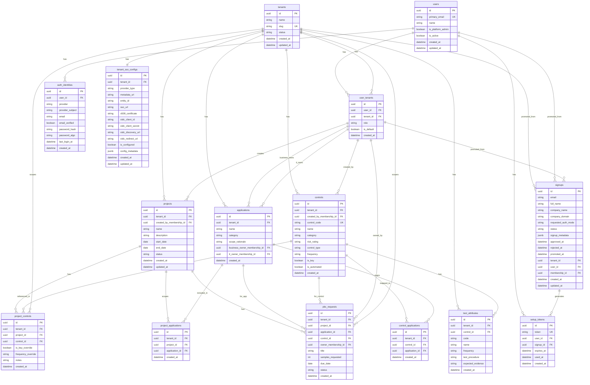

# ERD (Reference Only)

This ERD represents the **current data model** for Audexa AI.

**Important**
- This ERD is a **design contract**, not an instruction to auto-generate schema.
- Tables may already exist in the database.
- Migrations must be **incremental and safe**.

## Usage
- Referenced in Cursor prompts when planning migrations

---

