# Target ERD

This ERD represents the **target/future data model** for Audexa AI, including tables that are planned but not yet implemented.

**Important**
- This ERD is a **design contract** for future implementation
- Some tables may already exist (see `current-erd.md` for implemented tables)
- Migrations must be **incremental and safe**

## Usage
- Reference for future development
- Used as a checklist for upcoming features
- Referenced in Cursor prompts when planning migrations

---

```mermaid
erDiagram
  %% =========================
  %% CORE IDENTITY
  %% =========================
  users {
    uuid id PK
    string primary_email UK
    string name
    boolean is_platform_admin
    boolean is_active
    datetime created_at
    datetime updated_at
  }

  tenants {
    uuid id PK
    string name
    string slug UK
    string status
    string plan
    datetime created_at
    datetime updated_at
  }

  user_tenants {
    uuid id PK
    uuid user_id FK
    uuid tenant_id FK
    string role
    string status
    boolean is_default
    datetime created_at
  }

  auth_identities {
    uuid id PK
    uuid user_id FK
    string provider
    string provider_subject
    string email_claim
    boolean is_primary
    boolean email_verified
    string password_hash
    string password_algo
    datetime last_login_at
    datetime created_at
  }

  %% =========================
  %% SIGNUP + SSO
  %% =========================
  signups {
    uuid id PK
    string email
    string full_name
    string company_name
    string company_domain
    string requested_auth_mode
    string status
    jsonb signup_metadata
    uuid tenant_id FK
    uuid user_id FK
    uuid membership_id FK
    datetime approved_at
    datetime rejected_at
    datetime promoted_at
    datetime created_at
    datetime updated_at
  }

  setup_tokens {
    uuid id PK
    string token UK
    uuid user_id FK
    uuid signup_id FK
    datetime expires_at
    datetime used_at
    datetime created_at
  }

  tenant_sso_configs {
    uuid id PK
    uuid tenant_id FK
    string provider_type
    string metadata_url
    string entity_id
    string sso_url
    string x509_certificate
    string oidc_client_id
    string oidc_client_secret
    string oidc_discovery_url
    string oidc_redirect_uri
    boolean is_configured
    jsonb config_metadata
    datetime created_at
    datetime updated_at
  }

  %% =========================
  %% AUDIT STRUCTURE
  %% =========================
  projects {
    uuid id PK
    uuid tenant_id FK
    uuid created_by_membership_id FK
    string name
    string status
    date period_start
    date period_end
    datetime created_at
    datetime updated_at
  }

  applications {
    uuid id PK
    uuid tenant_id FK
    string name
    string category
    string scope_rationale
    uuid business_owner_membership_id FK
    uuid it_owner_membership_id FK
    datetime created_at
  }

  controls {
    uuid id PK
    uuid tenant_id FK
    uuid owned_by_membership_id FK
    string control_code UK
    string name
    string category
    string risk_rating
    string control_type
    string frequency
    boolean is_key
    boolean is_automated
    datetime created_at
    datetime updated_at
  }

  project_controls {
    uuid id PK
    uuid tenant_id FK
    uuid project_id FK
    uuid control_id FK
    boolean is_key_override
    string frequency_override
    string notes
    datetime created_at
  }

  frameworks {
    uuid id PK
    uuid tenant_id FK
    string name
    datetime created_at
  }

  control_frameworks {
    uuid id PK
    uuid tenant_id FK
    uuid control_id FK
    uuid framework_id FK
  }

  test_attributes {
    uuid id PK
    uuid tenant_id FK
    uuid control_id FK
    string code
    string name
    string frequency
    string test_procedure
    string expected_evidence
    datetime created_at
  }

  %% =========================
  %% PROJECT SCOPING
  %% =========================
  project_users {
    uuid id PK
    uuid tenant_id FK
    uuid project_id FK
    uuid membership_id FK
    string project_role
  }

  project_applications {
    uuid id PK
    uuid tenant_id FK
    uuid project_id FK
    uuid application_id FK
  }

  control_applications {
    uuid id PK
    uuid tenant_id FK
    uuid control_id FK
    uuid application_id FK
  }

  %% =========================
  %% PBC + EVIDENCE
  %% =========================
  pbc_requests {
    uuid id PK
    uuid tenant_id FK
    uuid project_id FK
    uuid application_id FK
    uuid owner_membership_id FK
    uuid primary_control_id FK
    string title
    int samples_requested
    date due_date
    string status
    datetime created_at
  }

  pbc_request_controls {
    uuid id PK
    uuid tenant_id FK
    uuid pbc_request_id FK
    uuid control_id FK
  }

  evidence_files {
    uuid id PK
    uuid tenant_id FK
    uuid pbc_request_id FK
    uuid uploaded_by_membership_id FK
    string filename
    string mime_type
    string storage_uri
    string content_hash
    int version
    uuid supersedes_file_id FK
    int page_count
    datetime uploaded_at
  }

  evidence_pages {
    uuid id PK
    uuid tenant_id FK
    uuid evidence_file_id FK
    int page_number
    string image_uri
    datetime created_at
  }

  %% =========================
  %% AI PIPELINE
  %% =========================
  ai_runs {
    uuid id PK
    uuid tenant_id FK
    uuid project_id FK
    uuid initiated_by_membership_id FK
    string level
    string status
    string model_name
    string model_version
    string prompt_version
    int latency_ms
    float cost_usd
    datetime created_at
  }

  ai_run_inputs {
    uuid id PK
    uuid tenant_id FK
    uuid ai_run_id FK
    uuid evidence_page_id FK
    json input_ref_json
  }

  ai_run_outputs {
    uuid id PK
    uuid tenant_id FK
    uuid ai_run_id FK
    json output_json
    float confidence
    datetime created_at
  }

  ai_l1_indexes {
    uuid id PK
    uuid tenant_id FK
    uuid ai_run_output_id FK
    uuid evidence_page_id FK
    json extracted_facts
  }

  ai_l2_indexes {
    uuid id PK
    uuid tenant_id FK
    uuid ai_run_output_id FK
    json timeline_summary
    json anomalies
  }

  ai_l3_indexes {
    uuid id PK
    uuid tenant_id FK
    uuid ai_run_output_id FK
    uuid test_attribute_id FK
    string status
    json rationale
    uuid reviewer_membership_id FK
    datetime updated_at
  }

  ai_l4_indexes {
    uuid id PK
    uuid tenant_id FK
    uuid ai_run_output_id FK
    uuid control_id FK
    string status
    json executive_summary
    uuid auditor_membership_id FK
    datetime updated_at
  }

  %% =========================
  %% FINDINGS
  %% =========================
  findings {
    uuid id PK
    uuid tenant_id FK
    uuid project_id FK
    uuid created_by_membership_id FK
    uuid ai_run_output_id FK
    string severity
    string title
    string description
    string status
    datetime created_at
  }

  %% =========================
  %% RELATIONSHIPS
  %% =========================
  users ||--o{ user_tenants : has
  tenants ||--o{ user_tenants : has
  users ||--o{ auth_identities : has

  users ||--o{ setup_tokens : has
  signups ||--o{ setup_tokens : generates

  tenants ||--|| tenant_sso_configs : has

  tenants ||--o{ projects : owns
  tenants ||--o{ applications : owns
  tenants ||--o{ controls : owns
  tenants ||--o{ frameworks : configures

  projects ||--o{ project_users : assigns
  user_tenants ||--o{ project_users : assigned_as

  projects ||--o{ project_applications : scopes
  applications ||--o{ project_applications : included_in

  controls ||--o{ project_controls : used_in
  projects ||--o{ project_controls : includes

  controls ||--o{ control_applications : mapped_to
  applications ||--o{ control_applications : maps

  controls ||--o{ test_attributes : has

  controls ||--o{ control_frameworks : tagged_as
  frameworks ||--o{ control_frameworks : includes

  projects ||--o{ pbc_requests : has
  applications ||--o{ pbc_requests : for_app
  user_tenants ||--o{ pbc_requests : owned_by

  pbc_requests ||--o{ pbc_request_controls : covers
  controls ||--o{ pbc_request_controls : required_for

  pbc_requests ||--o{ evidence_files : receives
  user_tenants ||--o{ evidence_files : uploaded_by
  evidence_files ||--o{ evidence_pages : splits_into

  tenants ||--o{ ai_runs : has
  projects ||--o{ ai_runs : has
  user_tenants ||--o{ ai_runs : initiated_by

  evidence_pages ||--o{ ai_run_inputs : used_as_input
  ai_runs ||--o{ ai_run_inputs : has_inputs

  ai_runs ||--o{ ai_run_outputs : produces
  ai_run_outputs ||--o{ ai_l1_indexes : indexes
  ai_run_outputs ||--o{ ai_l2_indexes : indexes
  ai_run_outputs ||--o{ ai_l3_indexes : indexes
  ai_run_outputs ||--o{ ai_l4_indexes : indexes

  test_attributes ||--o{ ai_l3_indexes : validates
  controls ||--o{ ai_l4_indexes : overall_for

  projects ||--o{ findings : tracks
  ai_run_outputs ||--o{ findings : may_create
  user_tenants ||--o{ findings : created_by

```

mermaid diagram link:
https://mermaid.live/edit#pako:eNq1Wu1P4zYY_1eiSPs07kQphaPSPtyAu3W7AeJl0iakyE3c4COxM9vh6ID_fY-dl9qJk4YWTidBbT9-Xvx7XsuTH7II-1Mf8xOCYo7SW-p5P_3k_dL1r9w_Pr889WYnp2fXs-u_h9DkAnPhPalf4UNOIg_-X_xRfBaSExp7GScp4ssAp4gk3o29SVGKi4U5YwlG1CMiyBIkF4ynAYpSQlvbKJTkoaSKkMSSpNgLOYZfowDJxkaeRcbGy62-T2KKqFwn-Uq4ckEkedzUQEgkc2FrnCC6lXjKrMEaGfVnfRB-fjEXC0JzuZSLgwk7ZTcMHOEFyhPZq0IpKcrlHXDCVBJJ8OuErfHBHuAG7lwMRD7_jkNpbWokBWGCSNrGToE2e70geMCcLAiObEZIiB-MR8EdEnfuHZTErGGLBAkZJCwmtP2iTjsNcL6r2dezmwvvZ-_q6nwIiSAxzbN1GNaqWyuLPEmCFrRDlmaILrs3IgY3URtP-N8cC62rgkEKQacTXt8Fo_NS5iDFEoG9UC9ouwGe4nQOceeOZOZW_QAoU-hxORvHCkuuHaBImXPndZ4rsAT9JLvHdN3L6EN1NOnWtrSZS1P8mBGOhUM2sV4VKxQGQrAgZHRB4n4n7gwutcfKZWbDoHrtIOc2EnXUWMJdNmpAkubJx8nuURBiLsGBQ9DB2mQkCiEaEKzl6twSGPSX7e2IiBDgAhmqyVVvcxyBjUMJu6QVbQqL5bwKKgXKi9UGyjcE1IDA8fnmZHbtXV1f3hxf31yeDqGCx1Ke8Nqn1suV_PNl4HbEzuxphAOlqZdBQGZRAOtctpcxjbayHISBRIGFMLohpNuxELjErMoulVohy3DANSNUJVh98TwXhGIhAvaDgmO4rVWIJHvP9HswwE1Cat_oMRXX9U9ZcghUWdldwfUZiRNxr21EY-fNraCx0MmFhsuWz93j9hrkH0hPEm-HmNIrgm0MWt3R8ppSUWPd1ilQMYiTqMMM7m0KOUsMwcgCmgAM1cz91q4wCIvBxvy6jKXX61tXO3UWg4IMSRB2nkv8VkxrkDbN3sR8A61VhldCASBCHEGKsFPfY1ZUIlglTRriNyoiLy7Pfz89hmxwfH4xO_v6ilwQ9PZym0C-N6RURFVP0nDBLYJ3r0zGvS0MVQDYlncXevt4D3naX4-hOTj9S_Xnx8Oy_FyVL7pGf38jGgmlN9VV44Bud4OisEqjhEpPoDRLoMituw2jVIhyHETNerBZZ3Q7lGGg7YK-cc9aNJS8K8cPFiTBb841zxKGogGpXXFvhbMULNZOyUIyjmK8KoSNHK4K7FUHrZ4N0pUAgJiNTA6VHTQm8JaKqymMIsjU3SHLaTtXl7pYb1fbT9FtZD_rBZzS0FxZzlIWwGuaYOuA_XnmXcwuTr_Nzga5NCIBz982JBJKJBlU0Sf4ASfrhl9qCuCYLxTLFihWmSDNpL2lXiABmVThk5b3LwAFEsAmVKqKBg2ntLECQrN8swBYXdAFHA0SY1e1f55mB465CNTHtjgsl28nj-ZY3FizW5kK2tDBxQXcnYzAVhF-xNsIVwrzOpvhR8mRrocW8EM0xNp7F7E0Y2WPBJq0QOTpam6otxCFliIhuCnN-P2MZFexDg9sTtQ8V9vJwdb4x_pm0t01g4b776dhd9ZvqQYChLma9NtvUzDJIwLZaCMNBwTlL7OzE6ier4YcX4CtQP63bRbXjVj6LV1ZFKuJt1x2FVflCuTjkJNMNuPy8DJqgEUvT799vp6dn139Nru4Gv7N0vPzhw_syf4-ZOpBoWF-idN7yLqn-W1Feap1zpri1ldVA3f3oRhD4Yt0O94U7vnZNWU1mDc0qadzU1VOu3S1WpTOU3VJ23nCaNOnXj3MFFYv1hSrbBSnHhLKIqL1hVXvcYWdNfc3lNPzNdGa6PUTERomuaoZ1VcW1pCsQWfYSA_NSa9oxumSg3Bf7-wlp14Kn4GJZF3qdNN1MGoOPgxUdclkPbpEcVy-iTUl6qOxVW_Zyuw6a-dxvp19cgEBHY514sk-XU0uW52ci8B8OD3sF05MuAnUEuGqNmG8m1ujn1NkIYbs1ekfLQKjZ3M0iE2qou0B9wC7SgG4VaByhYqyY6hfovlerQMuYVeHzHbB2YlZFFXxXXoXEsWC2cp0nL-rzgqzem4er4rpqVIrysMyUNibKxKjwlWa6N_6CfZeSzB-LcG-i8A10-xg8gBFaoTKOXAT0k0GCvsoSQwoN9BQlzMQGqAkv-8R3jiaomVQlAZdADIOr6qbW-rv-DEnkT-VPMc7fop5itRHX1dTt768w9BI-lP4NUL8_ta_pS9AkyH6D2NpRcZZHt_50wVKBHwqqr7yL1_qIxhswI_VeMGf7h_u6zv86ZP_6E9Ho92Pu5OjyWS8N9ndP5iMDnf8pT_9sP_p43g0OhqNJoe7B5OD8aeXHf8_zXb0cfzpYDIeH4wOjw7H473Dgx0f65L0z-Ivb_Qf4Lz8D2NJIlM